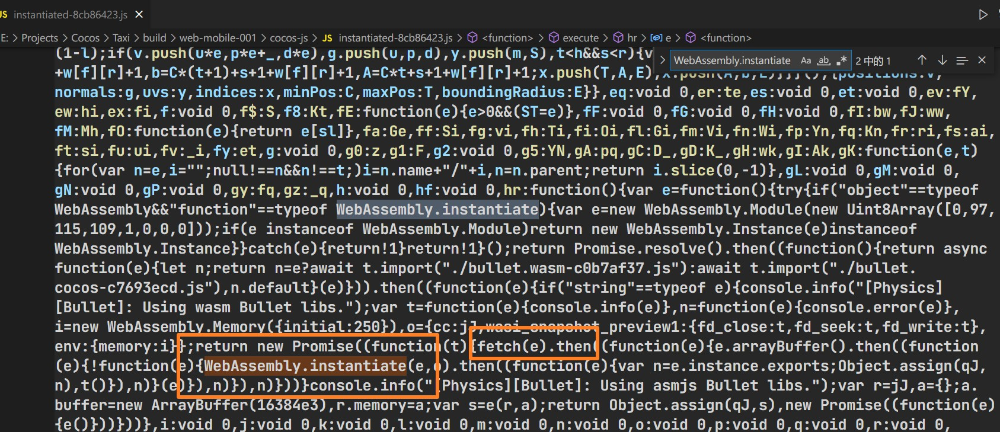

# CocosCreator3D PlayableAD

### [基于该项目修改](https://github.com/Jecced/c3d2one)

### 再次感谢该大佬的项目

## README 说明

-   [英语](README.en.md)
-   [简体中文](README.zh-CN.md)
-   [繁体中文](README.zh-TW.md)
-   [印地语](README.hi.md)
-   [法语](README.fr.md)
-   [阿拉伯](README.ar.md)

### 历史版本

## [CocosCreator3D 3.2.0](./version/Version%203.2.0.md)

## [CocosCreator3D 3.4.1](./version/Version%203.4.1.md)

## 制作原理

### 因为CocosCreator 从3d版本后就开始通过用[系统JS](https://github.com/systemjs/systemjs)来加载所有的脚本资源，但是SystemJS加载脚本的方式是通过web请求方式（可能方法说得不对）来加载脚本，但是Playable广告制作的前提条件就是不允许通过网络请求来加载资源，所有有关的资源必须要在同一个Html文件里面，所以早期版本是通过魔改SystemJS来加载，但是经过多方面测试（很久很久的测试），发现一些很巧妙的方法，可以不魔改SystemJS就可行

#### [系统注册](https://github.com/systemjs/systemjs/blob/main/docs/system-register.md)

CocosCreator3D 导出手机web项目后，里面很多系统有关的脚本都有以下特征，SystemJS注册的脚本，第一个数组里面是依赖项，代表依赖那些模块，会优先加载依赖模块

```javascript
System.register(['dependency'], function (_export, _context) {
  var dep;
  return {
    setters: [function (_dep) {
      dep = _dep;
    }],
    execute: function () {
      _export({
        name: 'value'
      });
    }
  };
});
```

然后System.register方法的第一个参数可以传入string，这个我称之为别名，通常是js文件的名称加上对应路径，因为有很多相同文件名的js文件，这些会做一些对应处理，像下面这样，比如该js文件为PPS.js,可以修改如下：

```javascript
System.register('./PPS.js'，['./PPY.js'], function (_export, _context) {
  var dep;
  return {
    setters: [function (_dep) {
      dep = _dep;
    }],
    execute: function () {
      _export({
        name: 'value'
      });
    }
  };
});
```

以上表示PPS.js在加载的时候会优先加载PPY.js文件，然后再加载PPS.js,
下面是PPYjs文件,

```javascript
System.register('./PPY.js'，[], function (_export, _context) {
  var dep;
  return {
    setters: [function (_dep) {
      dep = _dep;
    }],
    execute: function () {
      _export({
        name: 'value'
      });
    }
  };
});
```

然后把PPY.js,PPS.js注入到Html文件中，类似如下

```html

<script>
  System.register('./PPS.js'，['./PPY.js'], function (_export, _context) {
  var dep;
  return {
    setters: [function (_dep) {
      dep = _dep;
    }],
    execute: function () {
      _export({
        name: 'value'
      });
    }
  };
});
</script>
<script>
   System.register('./PPY.js'，[], function (_export, _context) {
  var dep;
  return {
    setters: [function (_dep) {
      dep = _dep;
    }],
    execute: function () {
      _export({
        name: 'value'
      });
    }
  };
});
</script>
<script>
   System.import('./PPS.js').catch(function (err) {
        console.error(err);
    })
</script>
```

（如果想正常运行示例，前提是注入SystemJS模块，否则无法正常运行）最下方的代码会成功执行

以上是简单的示例，该工程就是通过该方法做了大量对应处理，然后生成单个Html文件的

## WASM加载文件处理

由于可能需要物理引擎模块，当然也可能会选择WASM模块，这种情况就需要魔改一丢丢引擎源码（打开“项目目录/build/web-mobile/cocos-js/instantiated-\*\*.js”类似这个文件）
查找关键字段


```javascript
WebAssembly.instantiate()
```

如图，你会发现该脚本里面使用了fetch方法，这是PlayableAD 不允许的，所以只能更改对应fetch方法，替换如下(路径地址来自[WASM路径传入处理](./README.md#wasm路径传入处理))

```javascript
let url = "cocos-js/" + (e)
let wa = base64DecToArr(window.res[url])
WebAssembly.instantiate(wa, o).then((function (e) {
    var n = e.instance.exports;
    Object.assign(qJ, n),
        t()
}
), n) 
```

该段脚本获取传入的wasm资源的路径，所有的文本资源与二进制资源全部存在于window.res中

## WASM路径传入处理

打开“项目目录/build/web-mobile/cocos-js/bullet.wasm-\*\*\*\*.js”类似这个文件

```javascript
System.register([],(function(e,t){"use strict";return{execute:function(){
  e("default",new URL("assets/bullet.wasm-c98527b6.wasm",t.meta.url).href)}
  }}));

```

替换‘new URL()’整个参数为’assets/bullet.wasm-c98527b6.wasm‘，很不错，wasm文件的名称在CocosCreator3D 3.4.1版本的名称在打包的时候应该不会改变（如果有修改，请替换为正确的文件名称）
如下：

```javascript
System.register([],(function(e,t){"use strict";return{execute:function(){
    e("default","assets/bullet.wasm-c98527b6.wasm")
}}}));

```

# 必须要执行的操作

[wasm加载处理](./README.md#wasm加载文件处理)\|[WASM路径传入处理](./README.md#wasm路径传入处理)该操作是必须的，因为用到了JavaScript fetch操作方法，只能强制修改引擎源码（如果没有使用wasm可以忽略）
